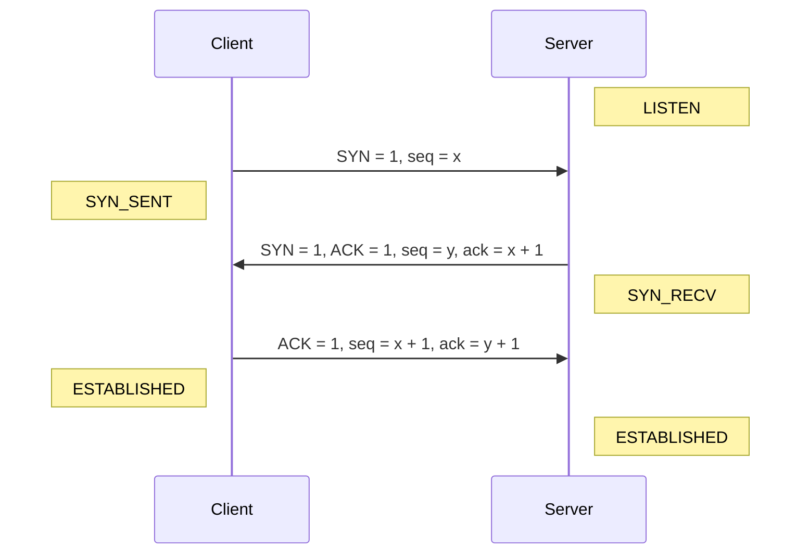
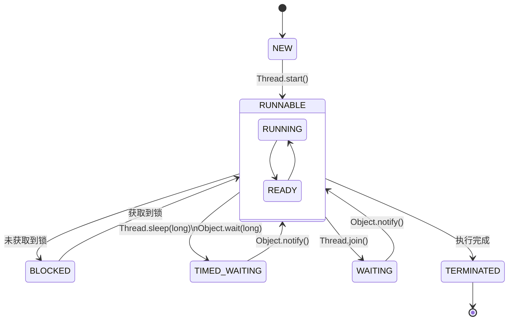

# Jian Doc · 简单文档

## 使用

- 创建一个 HTML 文件
- 创建一个 `<div id="app"></div>` 元素
- 引入 `jian-doc.umd.js`

可以从此处获取：[jian-doc.umd.js](https://ifyun.github.io/jian-doc/jian-doc.umd.js)

```html
<!doctype html>
<html lang="en">
  <head>
    <meta charset="UTF-8" />
    <title>My Documents</title>
    <script>
      window.$config = {
        prefix: "docs",
        logo: "logo.svg",
        logoRound: false,
        name: "My Documents"
      }
    </script>
  </head>
  <body>
    <div id="app"></div>
    <script src="jian-doc.umd.js"></script>
  </body>
</html>
```

根据以上的配置，你的目录结构应该长这样：

```bash
.
├─ docs
│  ├─ introcduction.md
│  ├─ quick-start.md
│  └─ menu.md
├─ index.html
├─ jian-doc.umd.js
└─ logo.svg
```

`menu.md` 将被渲染为菜单，若不存在 `menu.md`，`README.md` 中的标题会渲染为菜单。

`window.$config`：

- `prefix`：如果你想把文档放在子目录，则设置此选项
- `logo`：链接或者相对路径(`prefix` 不影响此选项)
- `logoRound`：是否使用圆角 Logo

`menu.md` 示例：

```markdown
- **UNIX 环境编程**
  - [文件读写](unixp/文件读写.md)
  - [Socket](unixp/socket.md)
- **Web**
  - [CSS 的黑魔法](web/css_magic.md)
```

## 重写样式

自定义字体/字重：

```css
:root {
  --font: "Source Han Sans SC", sans-serif !important;
  --font-weight: 300 !important;
  --font-weight-bold: 500 !important;
}
```

更多的变量可以按 <kbd>F12</kbd> 查看。

## 扩展

### 代码高亮

引入 `highlight.js`：

```html
<link
  rel="stylesheet"
  href="https://unpkg.com/@highlightjs/cdn-assets@11.9.0/styles/atom-one-dark.min.css" />
<script src="https://unpkg.com/@highlightjs/cdn-assets@11.9.0/highlight.min.js"></script>
<script src="https://unpkg.com/@highlightjs/cdn-assets@11.9.0/languages/xml.min.js"></script>
```

可选择你喜欢的主题和需要的语言。

> 可以在 [https://highlightjs.org/](https://highlightjs.org/) 查看详细用法。

### 公式

引入 `katex`：

```html
<link
  rel="stylesheet"
  href="https://unpkg.com/katex@0.16.9/dist/katex.min.css" />
<script src="https://unpkg.com/katex@0.16.9/dist/katex.min.js"></script>
```

### 图表

引入 `mermaid`，挂载到 `window` 对象：

```html
<script type="module">
  import mermaid from "https://unpkg.com/mermaid@10/dist/mermaid.esm.min.mjs"
  window.mermaid = mermaid
</script>
```

代码块语言为 `mermaid` 即可编写图表。

## 文档样式测试

### 段落

事物的矛盾法则，即对立统一的法则，是唯物辩证法的最根本的法则。列宁说：“就本来的意义讲，辩证法是研究对象的本质自身中的矛盾。”列宁常称这个法则为辩证法的本质，又称之为辩证法的核心。因此，我们在研究这个法则时，不得不涉及广泛的方面，不得不涉及许多的哲学问题。如果我们将这些问题都弄清楚了，我们就在根本上懂得了唯物辩证法。这些问题是：两种宇宙观；矛盾的普遍性；矛盾的特殊性；主要的矛盾和主要的矛盾方面；矛盾诸方面的同一性和斗争性；对抗在矛盾中的地位。

### 有序列表

1. 独立寒秋
2. 湘江北去
3. 橘子洲头

### 表格

| Abandon | Abnormal | Abolish  |
| :-----: | :------: | :------: |
|  放弃   |  反常的  | 彻底废除 |
|   ...   |   ...    |   ...    |

### 键盘

按下 <kbd>Ctrl</kbd> + <kbd>A</kbd> 全选，<kbd>Alt</kbd> + <kbd>f4</kbd> 关闭窗口。

### 数学公式

行内公式：$E=mc^2$

独立公式：

$$
y= \begin{cases} x^2, & x>0,\\ x^2 +x-8, & x \le 0 \end{cases}
$$

$$
A_{m,n} =
 \begin{pmatrix}
  a_{1,1} & a_{1,2} & \cdots & a_{1,n} \\
  a_{2,1} & a_{2,2} & \cdots & a_{2,n} \\
  \vdots  & \vdots  & \ddots & \vdots  \\
  a_{m,1} & a_{m,2} & \cdots & a_{m,n}
 \end{pmatrix}
$$

### Mermaid

序列图：



状态图：


