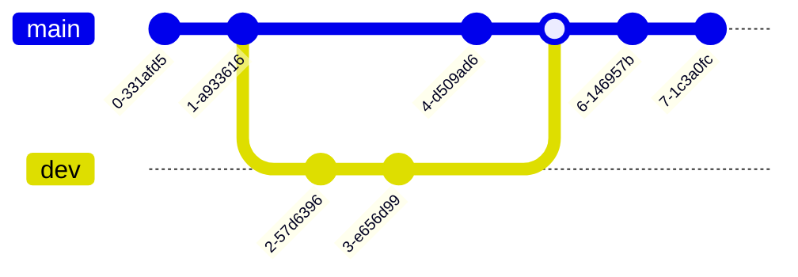
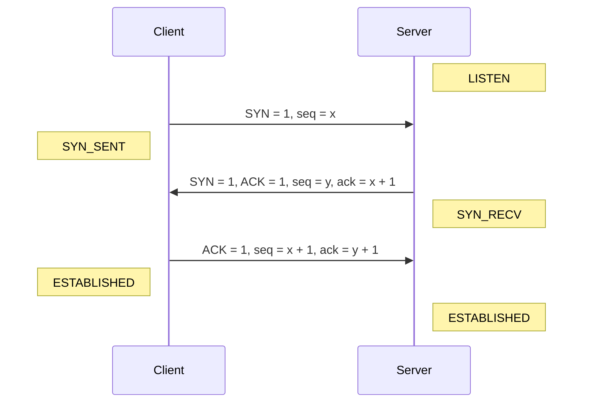
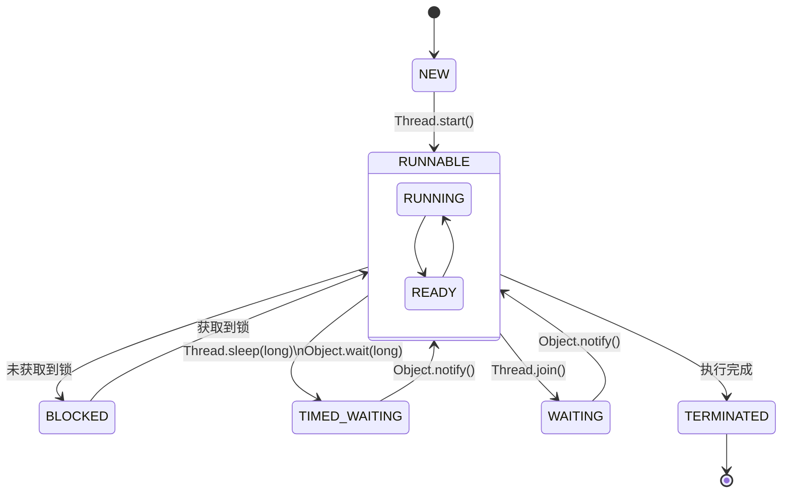

# 文档样式预览

## 段落

Markdown 是一种轻量级的标记语言，可用于在纯文本文档中添加格式化元素。Markdown 由 John Gruber 于 2004 年创建，如今已成为世界上最受欢迎的标记语言之一。

## 图片


## 列表

1. Abandon
2. Abnormal
3. Abolish

- 放弃
- 反常的
- 彻底废除

## 表格

| 单词     | 发音         | 释义     |
| :------- | :----------- | :------- |
| Abandon  | `/əˈbændən/` | 放弃     |
| Abnormal | `/æbˈnɔːml/` | 反常的   |
| Abolish  | `/əˈbɒlɪʃ/`  | 彻底废除 |

## 键盘

按下 <kbd>Ctrl</kbd> + <kbd>A</kbd> 全选，<kbd>Alt</kbd> + <kbd>f4</kbd> 关闭窗口。

## 代码

```c
#include <stdio.h>

int main() {
    printf("Hello, World!");
    return 0;
}
```

## 数学公式

行内公式：$E=mc^2$

独立公式：

$$
y= \begin{cases} x^2, & x>0,\\ x^2 +x-8, & x \le 0 \end{cases}
$$

$$
A_{m,n} =
\begin{pmatrix}
a_{1,1} & a_{1,2} & \cdots & a_{1,n} \\
a_{2,1} & a_{2,2} & \cdots & a_{2,n} \\
\vdots  & \vdots  & \ddots & \vdots  \\
a_{m,1} & a_{m,2} & \cdots & a_{m,n}
\end{pmatrix}
$$

## 图表

### Git 图



### 序列图



### 状态图


